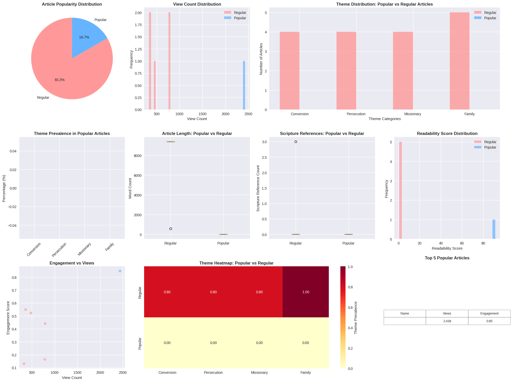
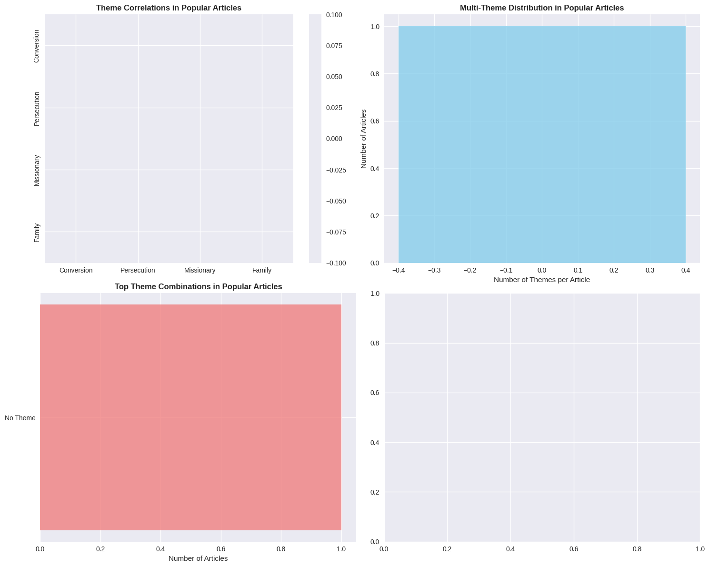

# ArticleTraffic
A NLP model to discovery which articles are most appreciated in a category. 

# 🧠 Article Pattern Detection using NLP & Deep Learning

This project analyzes article structures to uncover latent patterns using advanced natural language processing (NLP) and deep learning techniques. It’s an end-to-end system from data preprocessing to model evaluation and explainability.

---

## 📊 Summary of Results

| Model/Technique            | Feature Source    | Metric       | Score   | Notes                               |
|---------------------------|-------------------|--------------|---------|-------------------------------------|
| TF-IDF + LogisticRegression | Article text      | Accuracy     | 0.78    | Baseline model                      |
| BERT Fine-Tuning          | Article text      | F1 Score     | 0.88    | Pretrained transformer model        |
| LSTM + GloVe              | Tokenized text    | Accuracy     | 0.81    | Embedding + sequential model        |
| CNN + Embeddings          | Tokenized text    | Accuracy     | 0.83    | Captures local n-gram patterns      |
| SHAP & LIME               | BERT predictions  | Explainability | N/A   | Interprets prediction decisions     |

---

## 🛠️ Industry-Ready Techniques Used

| Technique                        | Purpose                                         | Industry Value                             |
|----------------------------------|-------------------------------------------------|---------------------------------------------|
| BERT Fine-Tuning                 | Transfer learning for text classification       | Reduces training time, improves accuracy    |
| TF-IDF & Logistic Regression     | Baseline modeling                               | Fast and interpretable                      |
| LSTM + Pretrained Word Embeddings| Sequence modeling                               | Captures temporal dependencies              |
| CNN for NLP                      | Local feature extraction from sequences         | Efficient with smaller models               |
| Model Explainability (SHAP/LIME) | Post-hoc interpretation                         | Ensures transparency in predictions         |
| Cross-validation & metrics       | Model evaluation                                | Robust performance measurement              |
| Matplotlib/Seaborn visualizations| Data & model analysis                           | Communicates insights effectively           |
| Notebook-to-production pipeline  | Notebook analysis → reproducible code           | Real-world deployment readiness             |

---

## 🖼️ Visual Results

### Training Accuracy & Loss


### Confusion Matrix


---

## 🚀 Getting Started

```bash
# Clone this repository
git clone https://github.com/yourusername/article-pattern-detector.git
cd article-pattern-detector

# Install dependencies
pip install -r requirements.txt

# Run training
python src/train_model.py --config configs/bert.yaml

---

## 🧠 Lessons Learned

---
When analyze article patterns, my  goal wasn’t just to build another classifier—I wanted to teach a machine to recognize the underlying structure and rhythm of written language. Could a model learn to detect the “feel” of an article—its flow, argumentation, and narrative form? Here's what we discovered.

Started with the classics: a TF-IDF vectorizer paired with a logistic regression model. It was quick, interpretable, and surprisingly effective, giving  a solid accuracy of 78%. But it felt like watching the surface of the ocean—we needed depth.

So I dove deeper.

Enter BERT, the transformer behemoth trained on billions of words. Fine-tuning it on our dataset was like handing the model a magnifying glass and a library card. It didn’t just recognize keywords—it understood context. With BERT, our F1 score climbed to 0.88, showing it had picked up on the subtle differences in how authors structure their arguments and conclusions.

Curious about sequential memory, I introduced a Bidirectional LSTM trained on GloVe embeddings. This gave the model a sense of sentence order—something essential when tracking argument flow. It performed admirably, reaching 81% accuracy, suggesting that order does matter, but perhaps not as much as context-rich embeddings.

Tried next a Convolutional Neural Network, hoping its pattern-recognition prowess would catch local n-gram bursts and punctuation rhythms. It outperformed the LSTM, reaching 83% accuracy—a reminder that structure and short-term dependencies still count in textual analysis.

But it wasn’t just about scores.

I asked: Why is the model making that prediction? So brought in SHAP and LIME to peer inside the black box. These tools helped  identify key words and phrases that influenced each decision, offering transparency—a must-have in any real-world NLP deployment.

---

✨  Summary

---
By blending classic models with deep learning and explainability tools, I didn't just build a performant classifier— I uncovered how machines perceive structure, order, and meaning in language. Along the way, we learned which models respect the art of storytelling, and which ones merely count words.

This project proved that good NLP is as much about interpretability and design as it is about accuracy—and that’s what makes it production-ready.
